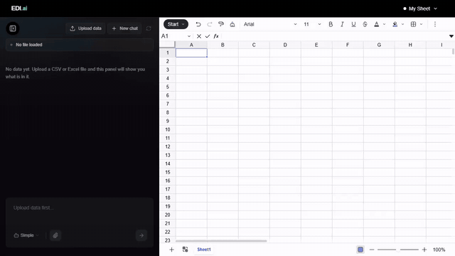

# EDI

**Your data, your model, your machine.**

Open a CSV or Excel file and ask it things in plain English: filter it, clean
it, chart it, write formulas for it, or have it explained back to you. You pick
the model, and by default it runs on your own hardware. No account, no API key,
nothing uploaded.

There is no sign-up because there is nothing to sign up to. Clone it, point it
at a model, and the whole thing runs on localhost.

<p align="center">
  
</p>

<p align="center">
  <em>A real model on a real machine: qwen3:4b through Ollama, with the
  workspace in a local file. Nothing in this recording talks to a hosted
  provider. The pauses while it thinks are cut; nothing else is.</em>
</p>

## Nothing leaves your machine

Both halves run where you are, and that is the default rather than a mode you
switch into. A model on `localhost:11434` answers the questions; a local SQLite
file holds the workspaces. Nothing your sheet contains crosses the network. Not
the rows, not the column names, not the question you asked. There is nobody on
the other end to send it to.

That is the point. The spreadsheets people actually have are salaries, patient
lists, client records, things under an NDA, things an employer's policy says
cannot be pasted into a chat window. The usual answer for those is that you
cannot use a tool like this at all.

**The cloud is still there if you want it.** EDI is a harness: it talks to
Ollama, to anything speaking the OpenAI-compatible wire format (LM Studio,
vLLM, llama.cpp, OpenRouter), to Claude through the CLI you are already signed
in to, or to Google, OpenAI, Anthropic and Groq. That is a choice you make, not
a default you have to undo.

If you do point it at a hosted model, here is what travels per question, which
is more than just the question: the text you typed and the last few messages of
the conversation; your column names; when it draws a chart, the values inside
your text columns, all of them for a column with twelve or fewer and three
examples for anything wider; and up to 200 rows of that query's results. All of
it avoidable by staying local -- written down because "your data stays private"
is a claim worth being precise about in both directions.

## Nothing to configure

The dropdown in the chat box lists what your machine can actually reach --
asked fresh each time it opens, not read from a config file. Models Ollama has
pulled. Claude, if `claude auth status` says the CLI is signed in. Any provider
whose key is already in your environment. Pick one and the next question uses
it; there is no restart and no `.env` to edit.

The first time you open a new install it asks, showing what it found rather
than making you go looking. Pick one and that is the end of it: the choice is
written next to your workspaces, so it survives a restart, a cleared browser
and a different browser, and the dialog does not come back.

A provider you have no key for offers **Add a key** instead of a model list.
That key is written to `.edi-data/model.json` on the machine running the
backend and is never sent back to the browser -- there is no endpoint that
returns one, only one that reports whether one exists. On a public deployment
the whole thing is switched off, because there the disk belongs to somebody
else.

## Documentation

Documentation is part of the app and is what you land on: run it and open
`/`, with the spreadsheet itself at `/app`. Or read the source in
[`edi-frontend/src/app/(docs)`](<edi-frontend/src/app/(docs)>). It covers the
quickstart, what you can ask it to do, the provider matrix, self-hosting, and
how it works.

## How it works

```
browser ──── /api/* ────► FastAPI ────► your model
   │                         │          (Ollama on localhost, by default)
   │                         │
   │                         └────────► workspace store
   │                                    (a local SQLite file)
   │
   └── remembers its anonymous workspace ids in localStorage
```

A workspace is a row keyed by a UUID in a local SQLite file, under
`EDI_DATA_DIR`. The browser keeps that UUID
in `localStorage` and sends it with every request; that is the whole identity
model. You can keep several workbooks, and the browser holds the list of them
-- there is no "list all workspaces" endpoint, because with no sign-in it
would hand every visitor everyone else's sheets. Clearing site data or opening
a different browser gets you a fresh, empty sheet.

The browser never talks to the store. Every read and write goes through the
backend, so the SQLite file stays on the machine running it and there is no
second set of credentials for the browser to hold.

Charts are returned as data, not images. The backend asks the model for
read-only SQL, runs it, and sends back a spec (chart type, axis key, series,
rows) that the client renders with Recharts, so no image file is written or
served. Workspaces are written, though: one local SQLite file, which is why
this wants a host with a real disk rather than a serverless function.

## Running it

Nothing is required, and there is nothing to configure for the local path --
it is what you get by default. EDI stores workspaces in a local SQLite file and
looks for a model on `localhost:11434`, where Ollama listens.

```bash
pip install -r backend/requirements.txt
pip install langchain-ollama==0.3.3     # only the provider you use

ollama serve
EDI_LLM_PROVIDER=ollama uvicorn main:app --reload --port 8000 --app-dir backend
```

Check the model can do the job before trusting it. A weak one does not error,
it answers confidently and wrongly:

```bash
EDI_LLM_PROVIDER=ollama python backend/check_model.py
```

That is the whole local setup. To use a hosted model instead, copy
`sample.env` to `.env` and put a key in it. Storage does not change: workspaces
are a SQLite file either way.

Then start the two halves:

```bash
# backend
pip install -r backend/requirements.txt
uvicorn main:app --reload --port 8000 --app-dir backend

# frontend
cd edi-frontend
npm install
echo "BACKEND_ORIGIN=http://127.0.0.1:8000" > .env.local
npm run dev
```

Open http://localhost:3000.

`BACKEND_ORIGIN` is read by `next.config.ts`, server-side, to proxy `/api/*` to
the backend so development is same-origin too. It is deliberately not a
`NEXT_PUBLIC_` variable: those are inlined into the browser bundle at build
time, so a stale one keeps redirecting a deployed site to a host nobody
remembers configuring. In production the two halves are one Vercel project on
one domain, so `BACKEND_ORIGIN` is left unset there.

## Deploying

Two processes: a Python ASGI app and a Next.js app. Host them however you
host those. Nothing here is written for a particular platform.

What the app needs from wherever you put it:

- **A disk.** Workspaces are a SQLite file under `EDI_DATA_DIR`, so the
  backend needs somewhere writable that survives a restart, and wants to be
  one instance rather than several sharing a volume. A VPS, a container with
  a volume, or any host that gives you persistent storage. Serverless
  platforms give you none of that, which is why the hosted site here serves
  documentation only.
- **A route from the browser to the API.** Simplest is one origin: put a
  reverse proxy in front and send `/api/*` to the Python process, everything
  else to Next. Then there is no CORS to think about. If you would rather run
  them on separate domains, name the frontend's origin in `EDI_CORS_ORIGINS`
  The API refuses a wildcard, because that would let any page on the
  internet call it.
- **A model.** A key for a hosted provider, or an Ollama the backend can
  reach. See [Choosing a model](https://github.com/illeniall239/EDI#the-model).

A plain server is two commands and a proxy:

```bash
uvicorn main:app --host 127.0.0.1 --port 8000 --app-dir backend
cd edi-frontend && npm run build && npm start      # BACKEND_ORIGIN unset if proxied
```

### Vercel, as one worked example

`vercel.json` is in the repository because it is what this project's
documentation site is served by. It is
read only by Vercel and ignored everywhere else, so it costs nothing if you
deploy elsewhere, and it is a reasonable thing to copy if you want the same
shape: both halves as services of one project, `/api/*` to Python, everything
else to Next, one domain, no CORS.

Two things about that platform specifically, both of which fail in ways that
look like something else:

- **Root Directory must be the repository root**, not `edi-frontend/`. Vercel
  only reads `vercel.json` from the directory it is given. Pointed at the
  subdirectory it ignores the file, serves the frontend alone, and every
  `/api/*` call lands on Next's 404 page.
- **The app itself will not run there**, only the documentation. The
  filesystem is read-only apart from `/tmp`, that does not survive between
  invocations, and two consecutive requests are not guaranteed to reach the
  same instance, so there is nowhere to keep a workspace. This is a property
  of serverless, not of EDI. Set `EDI_DOCS_ONLY=1` and host the app somewhere
  with a disk.

## Simple and Complex

The dropdown by the message box picks how a question is answered, not how hard
the model tries:

- **Simple**: one SQL query, run, and the rows written up. Two model calls.
  The default, and what nearly every question wants.
- **Complex**: a LangChain SQL agent that can query, read the result, and
  query again. Worth it when one query cannot answer the question.

Complex runs a ReAct loop, so the model has to keep a strict
thought/action/observation format across several turns. Capable hosted models
do; smaller local ones often do not, and fail back with a message saying so.
It is also more model calls, so it is slower and costs more.

## If you put this on a public URL

Don't, without putting authentication in front of it.

There are no usage caps. There used to be, sized for a public demo that no
longer exists, and every one of them was off unless you switched it on. On
your own machine they were an obstacle and nothing else: it is your model,
your key and your bill, and a cap of a few questions a minute helps nobody.

Which leaves the shape of a public deployment plain. There is no sign-up, so
every visitor is anonymous; every question is a model call charged to you; and
the model picker will let a visitor repoint the backend or store a key on your
disk unless `EDI_ALLOW_MODEL_SWITCHING=0`. A reverse proxy asking for a
password is a better answer than any of the settings this project could
offer, and it is the one this project expects you to use.

## Worth knowing

- **Sheets are capped at 11 MB of data**, and a bigger one is refused with a
  message saying what would fit. That is about 100,000 rows six columns wide,
  50,000 at twelve columns, 13,000 at forty.

  *Of data, not of file.* Nothing caps the upload. The same 100,000-row sheet
  is 3.18 MB as a CSV, 2.57 MB as an `.xlsx` and 10.05 MB as rows in the
  browser, and only the last of those is measured. An `.xlsx` is a zip, so a
  small file can be a large sheet; a workbook of twenty tabs can be the
  opposite, since only the first tab is read.

  The ceiling is the browser, not the server: the grid holds a JavaScript
  object per cell and runs out of memory, while the backend parsed and stored
  200,000 rows in three seconds. It is a cliff rather than a slope, and past
  it you get a spinner that never stops, so it says no instead.
  `EDI_MAX_DATA_MB` moves the cap and `EDI_MAX_DATA_MB=0` removes it. The
  Self-hosting page in the docs has the fifteen measurements it came from.
- The backend is stateless. Every request that touches the data re-reads it
  from the store and rebuilds an in-memory SQLite database, with a per-process
  cache keyed on a hash of the rows so a warm process skips the rebuild.
- Anyone who knows a workspace UUID can open it. They are unguessable, but
  this is not a substitute for access control. Don't put anything sensitive
  in a deployment you have shared.

## Layout

```
backend/
  main.py               FastAPI routes
  llm_providers.py      the provider table
  settings.py           resolves provider + model from the environment
  check_model.py        tests whether your model can do the job
  agent_services.py     LangChain agents, SQL generation, chart specs
  data_handler.py       file parsing, in-memory SQLite
  stores/               workspace persistence, a local SQLite file
edi-frontend/
  src/app/page.tsx      the entire app, one route
  src/app/(docs)/       the documentation site, served at /
  src/app/app/          the spreadsheet, served at /app
  src/components/       spreadsheet, chat sidebar, chart renderer
  src/utils/api.ts      every backend call
```

## Built on

**The spreadsheet is [Univer](https://univer.ai)** (Apache-2.0). EDI is a
harness around it, not a spreadsheet of its own: every cell, formula, filter
and sort you interact with is Univer's work. What this project adds is the
part that answers questions about what is in those cells, and the plumbing
that lets a model edit the sheet the way you would.

The rest:

| | |
|---|---|
| [Next.js](https://nextjs.org), [React](https://react.dev), [Tailwind](https://tailwindcss.com) | the frontend (MIT) |
| [Recharts](https://recharts.org) | charts, drawn from the spec the backend returns (MIT) |
| [FastAPI](https://fastapi.tiangolo.com), [Uvicorn](https://www.uvicorn.org) | the backend (MIT, BSD-3) |
| [LangChain](https://www.langchain.com) | one interface across the model providers (MIT) |
| [pandas](https://pandas.pydata.org) | parsing and everything done to the data (BSD-3) |
| SQLite | where workspaces live, in a file you can delete |

And the model, which is yours to pick.

## Licence

MIT. See [LICENSE](LICENSE).
